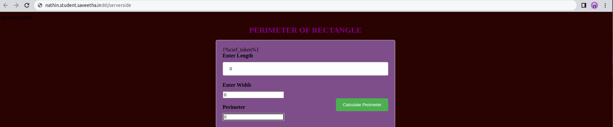

# Design a Website for Server Side Processing

## AIM:
To design a website to perform mathematical calculations in server side.

## DESIGN STEPS:

### Step 1:
clone the repository from GitHub


### Step 2:

Create Django admin project.

### Step 3:

Create New App.

### Step 4:

create python programes for views and urls.

### Step 5:
create a Html file of forms.

## PROGRAM :
```
perimeter.html

<!DOCTYPE html>
<html lang="en">
    <head>
        <title>PERIMETER OF RECTANGLE</title>
        <style>
        form {
  width: 500px;
  margin: 0 auto;
  background-color : rgb(126, 78, 138);
  border: 1px solid #ccc;
  border-radius: 5px;
  padding: 20px;
}

label {
  display: block;
  font-size: 16px;
  font-weight: bold;
  margin-bottom: 10px;
}

input[type="text"],
input[type="number"] {
  width: 100%;
  padding: 12px 20px;
  margin-bottom: 20px;
  box-sizing: border-box;
  border: 1px solid #ccc;
  border-radius: 4px;
  resize: vertical;
}

input[type="submit"] {
  background-color: #4CAF50;
  color: white;
  padding: 12px 20px;
  border: none;
  border-radius: 4px;
  cursor: pointer;
  float: right;
}

input[type="submit"]:hover {
  background-color: #7c1053;
}

.container {
  border-radius: 5px;
  background-color: #f2f2f2;
  padding: 20px;
}

.perimeter {
  margin-bottom: 20px;
  color: black;
  font-size: 20px;
  font-weight: bold;
}
h1 {
  text-align: center;
  font-size: 24px;
  color: purple;
}
body {
    background-color:rgb(41, 2, 2);
}

</style>
    </head>
            <body>
                <h1> PERIMETER OF RECTANGLE </h1>
                 <form method="POST" action="/perimeter/">
                    	
		 <label for="length">Enter Length</label>
         <input type="text" name="length" id="length" value="{{ length }}"/> <br>			
          <label for="width">Enter Width</label>
         <input type="width" name="width" id="width" value="{{ width }}"/><br>
          <input type="submit" value="Calculate Perimeter"/><br>

          <label for="perimeter">Perimeter</label>
         <input type="perimeter" name="perimeter" id="perimeter" value="{{ perimeter }}"/><br>
	</form>

            </body>
        
    
</html>

views.py

from django.shortcuts import render
def perimeter(request):
    context = {}
    context['length']="0"
    context['width']="0"
    context['perimeter']="0"

    if request.method == 'POST':
        print("POST METHOD IS USED")
        length=request.POST.get("length",0)
        width=request.POST.get("width",0)
        print('Length=',length)

        print('Width=',width)

        length_num = int(length)
        width_num = int(width)
        perimeter=2*(length_num+width_num)
        context['length']=length
        context['width']=width
        context['perimeter']=perimeter
        print('Perimeter=',perimeter)
    return render(request,"myapp/perimeter.html",context)

    urls.py

    from django.contrib import admin
from django.urls import path
from myapp import views

urlpatterns = [
    path('admin/', admin.site.urls),
    path('perimeter/',views.perimeter,name="perimeter"),
]
```

## OUTPUT:



## Result:
The programe for impiementing server side processing is completed successfully.
